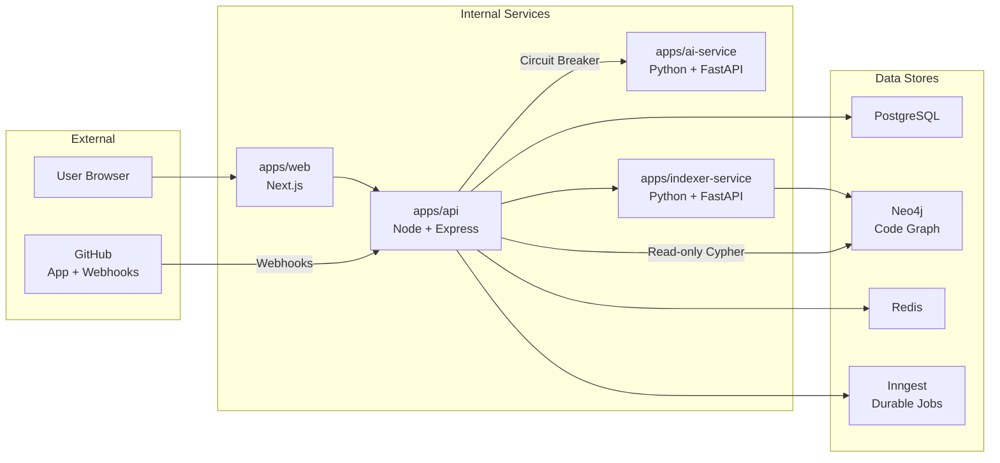
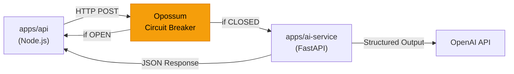
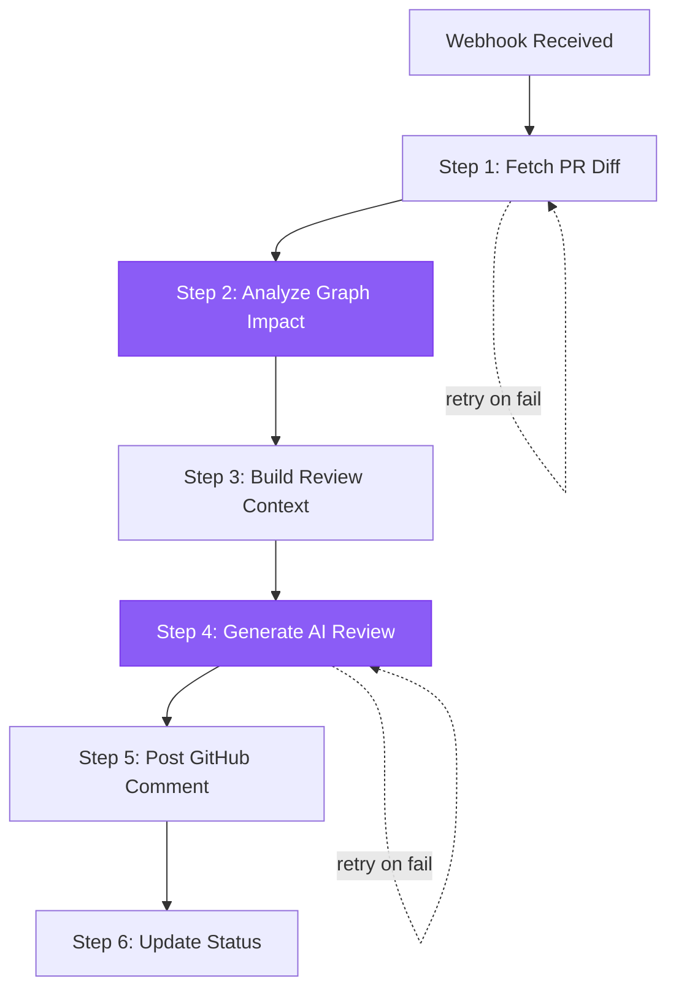
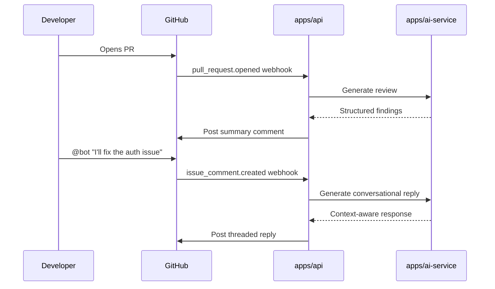
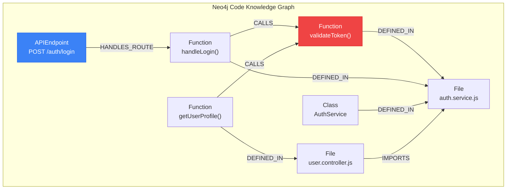
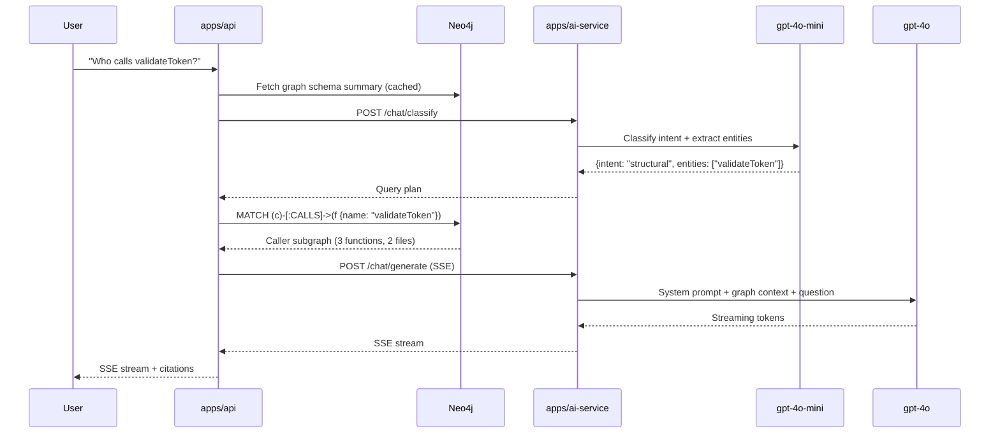

# Architectural Decision Records (ADRs)

Visual summary of all major architectural decisions made in this project. For detailed write-ups, see [`docs/architecture/`](docs/architecture/).

---

## ADR-001: Four-Service Topology

**Decision**: Split into 4 independent services instead of a monolith.

**Why**: Language fit (Node for CRUD/auth, Python for AI/AST), blast radius isolation, statelessness boundary, and independent deploys.

---

## ADR-003: Python AI Service Boundary

**Decision**: AI compute is a stateless Python service behind a circuit breaker.

**Why**: Python owns the AI SDK ecosystem. Stateless `(diff, context) → findings` makes it horizontally scalable. Never touches Postgres or GitHub credentials.

**Trade-offs**:
- ✅ If AI service is degraded, API stays up (users can login, browse past reviews)
- ✅ Prompt/model changes don't require API redeployment
- ⚠️ Extra network hop (~5ms latency), acceptable for AI calls

---

## ADR-005: Inngest Event-Driven Job Pipeline

**Decision**: Use Inngest for durable, step-based job orchestration instead of raw Redis queues.

**Why**: Each review pipeline step (fetch diff → graph impact → AI review → post comment) is independently retryable. No custom retry/dead-letter logic needed.

---

## ADR-006: Resilience — Circuit Breaker Pattern

**Decision**: All `api → ai-service` calls wrapped in an Opossum circuit breaker.

**Why**: Prevents cascade failures. If AI service returns 5 consecutive failures, breaker opens for 30s — subsequent requests fail fast instead of piling up timeouts.

| State | Behavior |
|---|---|
| **CLOSED** | Requests flow normally. Failures increment counter. |
| **OPEN** | All requests instantly rejected. Timer starts. |
| **HALF-OPEN** | One probe request allowed. Success → CLOSED, Failure → OPEN. |

---

## ADR-009: Comment Strategy & Conversational Bot

**Decision**: One summary comment per PR review (not inline review comments). Bot responds to @mentions in PR threads.

**Why**: Single summary avoids notification spam. @mention-based conversation is unambiguous and needs no heuristic tuning.

---

## ADR-010: Code Knowledge Graph (Neo4j + Tree-sitter)

**Decision**: Parse repositories into a Neo4j graph using Tree-sitter AST analysis instead of storing raw text chunks.

**Why**: Structural relationships (CALLS, IMPORTS, DEFINED_IN, HANDLES_ROUTE) enable blast-radius analysis that text similarity search cannot achieve.

**Incremental Update Strategy**:
- On PR merge → SHA256 hash check per file → only re-parse changed files
- Delete old subgraph for modified files → re-insert new symbols
- Zero embedding cost (pure AST, no OpenAI calls)

---

## ADR-011: Chat with Repo — Hybrid Graph-RAG (No Vector DB)

> **Status**: Approved  
> **Date**: 2026-09-02

**Decision**: Implement "Chat with your Repo" using **Hybrid Graph-RAG** that queries the existing Neo4j code knowledge graph directly, instead of adding a vector database (Qdrant/pgvector).

### Context

Users want to ask natural language questions about their indexed repositories:
- *"Who calls the handleAuth function?"* (structural)
- *"How does the review pipeline work?"* (semantic/architectural)
- *"What API endpoints exist?"* (enumeration)

Three approaches were evaluated:

### Options Considered

```mermaid
graph TB
    subgraph "Option A: Pure Vector RAG ❌"
        A1["Chunk code into text blocks"]
        A2["Embed with OpenAI text-embedding-3"]
        A3["Store in Qdrant"]
        A4["Similarity search on query"]
        A5["Top-K chunks → LLM"]

        A1 --> A2 --> A3 --> A4 --> A5
    end

    subgraph "Option B: Pure Graph (Text-to-Cypher) ⚠️"
        B1["LLM generates Cypher query"]
        B2["Execute on Neo4j"]
        B3["Return raw graph results"]

        B1 --> B2 --> B3
    end

    subgraph "Option C: Hybrid Graph-RAG ✅"
        C1["gpt-4o-mini: Classify intent"]
        C2["Extract entity names"]
        C3["Targeted Cypher queries"]
        C4["Build context from subgraph"]
        C5["gpt-4o: Generate grounded answer"]

        C1 --> C2 --> C3 --> C4 --> C5
    end

    style A1 fill:#fee2e2,stroke:#fca5a5
    style A5 fill:#fee2e2,stroke:#fca5a5
    style B3 fill:#fef3c7,stroke:#fcd34d
    style C1 fill:#dcfce7,stroke:#86efac
    style C5 fill:#dcfce7,stroke:#86efac
```

### Trade-off Matrix

| Criteria | Pure Vector RAG | Pure Graph | **Hybrid Graph-RAG** |
|---|---|---|---|
| Structural accuracy | ❌ No call-graph awareness | ✅ Deterministic | ✅ **Deterministic** |
| Semantic questions | ✅ Fuzzy similarity | ⚠️ Needs exact names | ✅ **Intent → Graph** |
| Incremental updates | ❌ Re-embed on every merge | ✅ SHA256 delta | ✅ **Zero cost** |
| Multi-tenant RAM cost | ❌ High (HNSW per repo) | ✅ Low (disk-based) | ✅ **Minimal** |
| LLM token cost/query | ❌ ~8K tokens (raw chunks) | ✅ ~2K (precise) | ✅ **~4K (targeted)** |
| Embedding API cost | ❌ $0.13/1M tokens | ✅ $0 | ✅ **$0** |
| New infrastructure | ❌ Qdrant container | ✅ None | ✅ **None** |

### Pipeline Architecture

### Dual-Model Cost Strategy

| Step | Model | Tokens | Cost/query |
|---|---|---|---|
| Intent Classification | gpt-4o-mini | ~600 | ~$0.00008 |
| Answer Generation | gpt-4o | ~4800 | ~$0.016 |
| **Total** | | | **~$0.016** |
| **1000 queries/month** | | | **~$16/month** |

### Memory Management

- **STM (Short-Term Memory)**: Last 10 messages in conversation context window
- **LTM (Long-Term Memory)**: Mem0 integration for cross-session user preference recall
- **Eviction**: Managed by Mem0's built-in policies (no custom logic needed)

### Consequences

- ✅ No new infrastructure (reuses existing Neo4j + ai-service)
- ✅ Zero embedding cost — saves $2-5/repo/month at scale
- ✅ Answers are grounded in deterministic graph structure, not fuzzy similarity
- ✅ Incrementally synced on every PR merge (already implemented)
- ⚠️ Cannot answer questions about code that Tree-sitter didn't parse (e.g., comments, README prose)
- ⚠️ Requires maintaining Cypher query strategies as graph schema evolves
