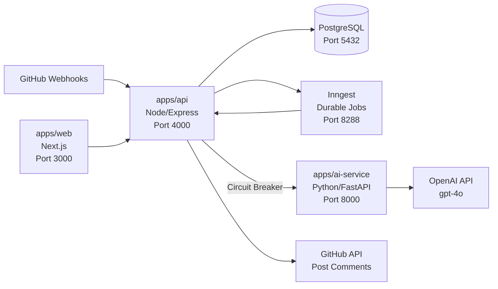

# 🔍 Project Analysis — archadi-pr-review Bot

## What Is This Project?

An **AI-powered GitHub PR Review Bot** that automatically reviews pull requests using OpenAI. It reads diffs, understands usage context (where changed functions are called), generates structured review comments, and posts them directly on the PR on GitHub.

---

## Architecture Overview



Three main services:

| Service | Tech | Role | Status |
|---------|------|------|--------|
| **apps/api** | Node/Express + Sequelize | Backend — webhooks, auth, orchestration, DB | ✅ ~90% done |
| **apps/ai-service** | Python/FastAPI + OpenAI | Stateless AI — review generation, conversation replies | ✅ ~85% done |
| **apps/web** | Next.js | User dashboard | ⬜ **Not started** (only stub files) |

---

## Service-by-Service Breakdown

### 1. `apps/api` (Node/Express) — The Brain

#### ✅ What's BUILT and WORKING:

| Layer | Files | Description |
|-------|-------|-------------|
| **Config** | [`config/`](file:///b:/Personal-Projects/GenAI/PR-Review_Bot/apps/api/src/config) | Zod-validated env config, typed |
| **Logging** | [`utils/logger.js`](file:///b:/Personal-Projects/GenAI/PR-Review_Bot/apps/api/src/utils) | Pino structured logging |
| **Middlewares** | [`middlewares/`](file:///b:/Personal-Projects/GenAI/PR-Review_Bot/apps/api/src/middlewares) | Request logger, error handler, 404, validation, auth guard |
| **Express App** | [`app.js`](file:///b:/Personal-Projects/GenAI/PR-Review_Bot/apps/api/src/app.js) | Helmet, CORS, compression, rate-limit, raw-body capture, cookie-parser |
| **Server** | [`server.js`](file:///b:/Personal-Projects/GenAI/PR-Review_Bot/apps/api/src/server.js) | DB health check, graceful shutdown |
| **8 Models** | [`models/`](file:///b:/Personal-Projects/GenAI/PR-Review_Bot/apps/api/src/models) | User, Installation, Repository, PullRequest, ReviewJob, ReviewComment, ConversationMessage, JobEvent |
| **8 Migrations** | [`db/migrations/`](file:///b:/Personal-Projects/GenAI/PR-Review_Bot/apps/api/src/db/migrations) | Complete schema creation for all models |
| **Demo Seeder** | [`db/seeders/`](file:///b:/Personal-Projects/GenAI/PR-Review_Bot/apps/api/src/db/seeders) | Sample data |
| **GitHub Webhooks** | [`integrations/github/`](file:///b:/Personal-Projects/GenAI/PR-Review_Bot/apps/api/src/integrations/github) | HMAC verification, App auth (JWT + installation tokens), PR/diff fetch, comment posting |
| **AI Client** | [`integrations/ai-service-client/`](file:///b:/Personal-Projects/GenAI/PR-Review_Bot/apps/api/src/integrations/ai-service-client) | HTTP client with Opossum circuit breaker |
| **Webhook Service** | [`webhook.service.js`](file:///b:/Personal-Projects/GenAI/PR-Review_Bot/apps/api/src/services/webhook.service.js) | Transaction-wrapped: Installation → Repo → PR → ReviewJob → JobEvent + Inngest event emit |
| **Review Service** | [`review.service.js`](file:///b:/Personal-Projects/GenAI/PR-Review_Bot/apps/api/src/services/review.service.js) | Diff fetch, usage resolution, findings generation, summary post |
| **Review Pipeline** | [`review-pipeline.job.js`](file:///b:/Personal-Projects/GenAI/PR-Review_Bot/apps/api/src/jobs/review-pipeline.job.js) | Full Inngest pipeline: fetch-diff → resolve-usages → generate-review → post-comment → COMPLETED |
| **Comment Reply** | [`handle-comment-reply.job.js`](file:///b:/Personal-Projects/GenAI/PR-Review_Bot/apps/api/src/jobs/handle-comment-reply.job.js) | @mention detection → load context → AI reply → post |
| **Auth** | [`auth.service.js`](file:///b:/Personal-Projects/GenAI/PR-Review_Bot/apps/api/src/services/auth.service.js) + routes | GitHub OAuth login, JWT session (httpOnly cookie), CSRF double-submit |
| **Repositories API** | [`repository.service.js`](file:///b:/Personal-Projects/GenAI/PR-Review_Bot/apps/api/src/services/repository.service.js) + routes | List/get/toggle active, ownership-scoped |
| **Review Jobs API** | [`review-job.service.js`](file:///b:/Personal-Projects/GenAI/PR-Review_Bot/apps/api/src/services/review-job.service.js) + routes | Cursor-paginated list, full detail view |
| **Routes** | [`routes/`](file:///b:/Personal-Projects/GenAI/PR-Review_Bot/apps/api/src/routes) | `/webhooks/github`, `/auth/*`, `/repositories`, `/review-jobs`, `/health` |

#### ⬜ What's NOT done:
- Migrations never tested against real Postgres
- Auth flow (OAuth round-trip) never tested
- No automated tests (`npm test` = no-op)
- No ESLint config
- `onFailure` handler for Inngest (jobs don't get marked FAILED on retry exhaustion)
- `cookie-parser` in `package.json` but `npm install` never re-run

---

### 2. `apps/ai-service` (Python/FastAPI) — The AI Brain

#### ✅ What's BUILT:

| Component | Files | Description |
|-----------|-------|-------------|
| **Config** | [`core/config.py`](file:///b:/Personal-Projects/GenAI/PR-Review_Bot/apps/ai-service/app/core) | Pydantic Settings, env validation |
| **OpenAI Client** | [`core/openai_client.py`](file:///b:/Personal-Projects/GenAI/PR-Review_Bot/apps/ai-service/app/core) | Async OpenAI client setup |
| **Middleware** | [`core/middleware.py`](file:///b:/Personal-Projects/GenAI/PR-Review_Bot/apps/ai-service/app/core) | Body size limit, request logging |
| **Schemas** | [`schemas/`](file:///b:/Personal-Projects/GenAI/PR-Review_Bot/apps/ai-service/app/schemas) | Finding, ReviewRequest/Response, ConversationRequest/Response — all Pydantic |
| **Review Agent** | [`agents/review_agent.py`](file:///b:/Personal-Projects/GenAI/PR-Review_Bot/apps/ai-service/app/agents/review_agent.py) | OpenAI structured outputs + Pydantic validation + retry on transient errors |
| **Conversation Agent** | [`agents/conversation_agent.py`](file:///b:/Personal-Projects/GenAI/PR-Review_Bot/apps/ai-service/app/agents/conversation_agent.py) | Reply generation, length capped |
| **Prompts** | [`agents/prompts/`](file:///b:/Personal-Projects/GenAI/PR-Review_Bot/apps/ai-service/app/agents/prompts) | System prompts as markdown files |
| **Guardrails** | Spread across | Input capping, prompt-injection resistance, output bounding, body-size limit |
| **API Routes** | [`api/`](file:///b:/Personal-Projects/GenAI/PR-Review_Bot/apps/ai-service/app/api) | `POST /review/generate`, `POST /conversation/reply`, `GET /health` |
| **Main** | [`main.py`](file:///b:/Personal-Projects/GenAI/PR-Review_Bot/apps/ai-service/app/main.py) | FastAPI assembly, global exception handler |

#### ⬜ What's NOT done:
- **Never run** — no `pip install`, no boot test, no real OpenAI call
- No automated tests

---

### 3. `apps/web` (Next.js) — The Dashboard

> [!CAUTION]
> **Completely empty.** Only [`Dockerfile`](file:///b:/Personal-Projects/GenAI/PR-Review_Bot/apps/web/Dockerfile), [`README.md`](file:///b:/Personal-Projects/GenAI/PR-Review_Bot/apps/web/README.md), and a stub [`package.json`](file:///b:/Personal-Projects/GenAI/PR-Review_Bot/apps/web/package.json) exist. No `app/`, `components/`, `lib/` — no actual Next.js code at all.

---

### 4. Infra / Docker / CI

| Item | Status |
|------|--------|
| [`docker-compose.local.yml`](file:///b:/Personal-Projects/GenAI/PR-Review_Bot/docker-compose.local.yml) | ✅ Written (Postgres, ai-service, api, web, Inngest Dev Server) |
| [`docker-compose.prod.yml`](file:///b:/Personal-Projects/GenAI/PR-Review_Bot/docker-compose.prod.yml) | ✅ Written |
| [`Makefile`](file:///b:/Personal-Projects/GenAI/PR-Review_Bot/Makefile) | ✅ `make dev` / `make prod` / `make db-migrate` / `make db-seed` |
| API Dockerfile | ✅ Multi-stage dev/prod |
| AI-Service Dockerfile | ✅ Multi-stage dev/prod |
| Web Dockerfile | ✅ Written but no app to build |
| `.github/workflows/` | ⬜ **No CI pipeline** |
| 9 ADRs + data model doc | ✅ Full architecture documentation |

---

## Kya Hum Isko Abhi Run Kar Sakte Hain? — **Haan, Partially!**

> [!IMPORTANT]
> Backend core (API + AI Service + DB) Docker ke through run ho sakta hai. Web dashboard nahi chalega kyunki wo bana hi nahi hai.

### Prerequisites (Tumhare paas ye hona chahiye):

| Requirement | Why |
|-------------|-----|
| **Docker Desktop** | Sab services containers mein chalti hain |
| **OpenAI API Key** | AI review generation ke liye (`gpt-4o`) |
| **GitHub App** (optional for first boot) | Webhooks aur PR access ke liye — pehle sirf health check test ke liye iske bina bhi chal jayega |

### Step-by-Step: Kaise Run Karein

#### Step 1: `.env` files create karo

**Root `.env`** (copy from [`.env.example`](file:///b:/Personal-Projects/GenAI/PR-Review_Bot/.env.example)):
```bash
cp .env.example .env
# Fill in Postgres credentials (defaults are fine for local)
```

**API `.env`** (copy from [`apps/api/.env.example`](file:///b:/Personal-Projects/GenAI/PR-Review_Bot/apps/api/.env.example)):
```bash
cp apps/api/.env.example apps/api/.env
# Must fill: JWT_SECRET (any random string)
# Can leave GitHub App/OAuth fields empty for initial boot test
```

**AI Service `.env`** (copy from [`apps/ai-service/.env.example`](file:///b:/Personal-Projects/GenAI/PR-Review_Bot/apps/ai-service/.env.example)):
```bash
cp apps/ai-service/.env.example apps/ai-service/.env
# Must fill: OPENAI_API_KEY
```

#### Step 2: `npm install` (API ke liye, cookie-parser pick up ke liye)
```bash
cd apps/api
npm install
cd ../..
```

#### Step 3: Docker Compose start karo
```bash
make dev
# OR: docker compose -f docker-compose.local.yml up --build
```

This starts 5 containers:
- ✅ **postgres** (port 5432)
- ✅ **ai-service** (port 8000)
- ✅ **api** (port 4000)
- ⚠️ **web** (port 3000) — **WILL FAIL** (no Next.js app code)
- ✅ **inngest** (port 8288) — Dev server UI

#### Step 4: Run migrations
```bash
make db-migrate
make db-seed
```

#### Step 5: Test health endpoints
```bash
# API health
curl http://localhost:4000/health/live
curl http://localhost:4000/health/ready

# AI Service health
curl http://localhost:8000/health
```

> [!WARNING]
> **`web` service container WILL CRASH** because there's no actual Next.js app. Isko docker-compose se temporarily comment out karo ya ignore karo — api aur ai-service dono independently chal jayenge.

#### Step 6: Full E2E test ke liye (Advanced)

For the actual PR review flow to work end-to-end, you'd need:
1. A registered **GitHub App** (webhook URL pointing to your machine via a tunnel like ngrok)
2. A registered **GitHub OAuth App** (for user login)
3. A tunnel: `ngrok http 4000` → set webhook URL to the ngrok URL

---

## Summary: Kahan Tak Pahunche Ho

```
██████████████████░░░░░░  ~70% Overall
```

| Component | Progress | Runnable? |
|-----------|----------|-----------|
| Backend API (api) | ██████████████████░░ 90% | ✅ Haan, Docker se |
| AI Service (ai-service) | █████████████████░░░ 85% | ✅ Haan, Docker se |
| Database (Postgres + Migrations) | █████████████████░░░ 85% | ✅ Haan (never tested though) |
| Inngest Jobs Pipeline | █████████████████░░░ 85% | ✅ With Inngest Dev Server |
| GitHub Integration (code) | ██████████████████░░ 90% | ⚠️ Needs real GitHub App |
| Web Dashboard | ░░░░░░░░░░░░░░░░░░░░ 0% | ❌ Nahi |
| Tests | ░░░░░░░░░░░░░░░░░░░░ 0% | ❌ Koi test nahi |
| CI/CD | ░░░░░░░░░░░░░░░░░░░░ 0% | ❌ Nahi |

### Immediate Next Steps (Priority Order):

1. **`make dev`** chala ke dekho — kya sab containers uthte hain?
2. **`make db-migrate`** — kya 8 migrations Postgres pe clean apply hoti hain?
3. **AI Service manual test** — `/review/generate` pe fake diff bhej ke OpenAI call test karo
4. **Web dashboard decide** karo — build karna hai ya sirf API + GitHub integration mature karna hai pehle?
5. **GitHub App register** karo for real PR review testing
